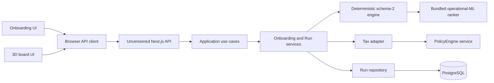
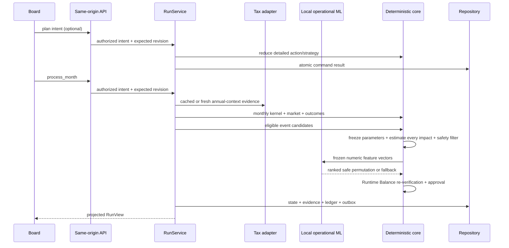

# Architecture overview

Life Finance has one active product path: persona onboarding creates an authoritative run, then the 3D board reads and changes it through a same-origin browser API.

The development-only demo replaces PostgreSQL with an in-memory repository and PolicyEngine with a simplified deterministic tax adapter. It retains the same browser API, HttpOnly cookie, use cases, and core engine.

## Runtime boundaries

- The board renders `RunView`; it never receives persisted `GameStateV2`.
- The browser submits command intent. It does not choose schema version, effective month, tax evidence, market draw, event probability, or ledger entries.
- Application use cases validate public intent and attach server-owned command metadata.
- `RunService` orchestrates tax evidence, deterministic reduction, market/event policy, persistence, and projection.
- The core owns exact-cent financial math, event effects, outcomes, replay, and state invariants.
- PostgreSQL owns the current state, revisions, idempotency records, evidence, snapshots, ledger, and outbox.
- A bundled, self-trained linear ranker orders already-eligible, already-preflighted candidates in-process. It cannot invent events or effects. Runtime Balance re-verifies the selected event, and invalid/out-of-domain model evidence falls back deterministically.

## Monthly command flow

The board deliberately issues the plan and month as two revisioned commands. Its recovery logic detects partial success, refreshes authoritative state, and can retry only the missing month so a plan is not applied twice.

## Main folders

| Folder | Responsibility |
| --- | --- |
| `src/app` | Next.js pages and thin route adapters |
| `src/features/board` | WebGL scene, HUD, strategy dialogs, and `RunView` display mapping |
| `src/features/onboarding` | Persona/profile UI and client-side flow state |
| `src/contracts/api` | Public, unversioned JSON schemas and lightweight OpenAPI document |
| `src/lib/api-client` | Same-origin browser client with response validation |
| `src/application/game` | Use cases and frontend-safe projection |
| `src/server/api` | Runtime composition, HTTP handlers, onboarding, and run orchestration |
| `src/server/auth` | Cookie session and same-origin write protection |
| `src/server/db` | Drizzle/PostgreSQL persistence, snapshots, replay, and history |
| `src/server/tax` | Tax-service client, caching context, and adapters |
| `ml/event_ranker`, `src/core/operational-event-ranker-v1.ts` | Offline self-training and network-free production inference |
| `src/server/ai`, `src/server/teaching` | Optional provider and unmounted teaching/narration services; not in the monthly hot path |
| `src/core` | Pure deterministic domain engine |

## Adding player-visible behavior

1. Implement and test the deterministic rule in `src/core`.
2. Add a versionless intent in `src/contracts/api` only when the browser needs it.
3. Map that intent to the current internal command in the application layer.
4. Persist it atomically and expose only the necessary `RunView` fields.
5. Add the board interaction and an end-to-end contract test.

An implemented core module is not a shipped feature until a public route/use case and a UI surface actually reach it.
