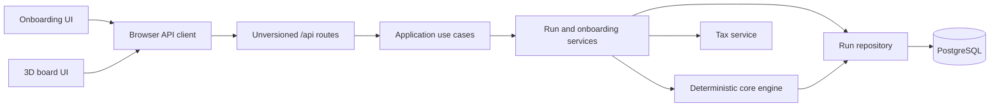

# Architecture overview

Life Finance has one product path: onboarding creates an authoritative run, then the 3D board reads and changes that run through the same-origin API.

## Boundary rules

- The board renders only `RunView`, never persisted engine state.
- The browser submits command intent. It does not choose schema versions, simulation month, tax evidence, ledger entries, or random outcomes.
- The application layer supplies server-owned command metadata and projects engine state into `RunView`.
- The deterministic core owns financial math, events, outcomes, replay, and ledger invariants.
- PostgreSQL owns authoritative runs, accepted commands, snapshots, evidence, and the transactional outbox.
- AI may extract onboarding candidates or rewrite explanations. It never mutates authoritative financial state directly.

## Main folders

| Folder | Responsibility |
| --- | --- |
| `src/app` | Next.js pages and thin route adapters |
| `src/features/board` | 3D scene, HUD, movement, and `RunView` mapping |
| `src/features/onboarding` | Persona/profile flow and run creation state |
| `src/contracts/api` | Public, unversioned JSON schemas |
| `src/lib/api-client` | Credential-free browser client |
| `src/application/game` | Use cases and the frontend-safe projection |
| `src/server/api` | Runtime composition and service orchestration |
| `src/server/auth` | Run-session cookie and same-origin protection |
| `src/server/db` | Drizzle/PostgreSQL repositories and replay |
| `src/core` | Pure deterministic domain engine |

## Adding behavior

1. Add or change the core rule with deterministic tests.
2. Expose a versionless intent in `src/contracts/api` if the browser needs it.
3. Map intent to the current engine command in the application layer.
4. Return a projected `RunView`.
5. Update the board without importing server or engine state types.
